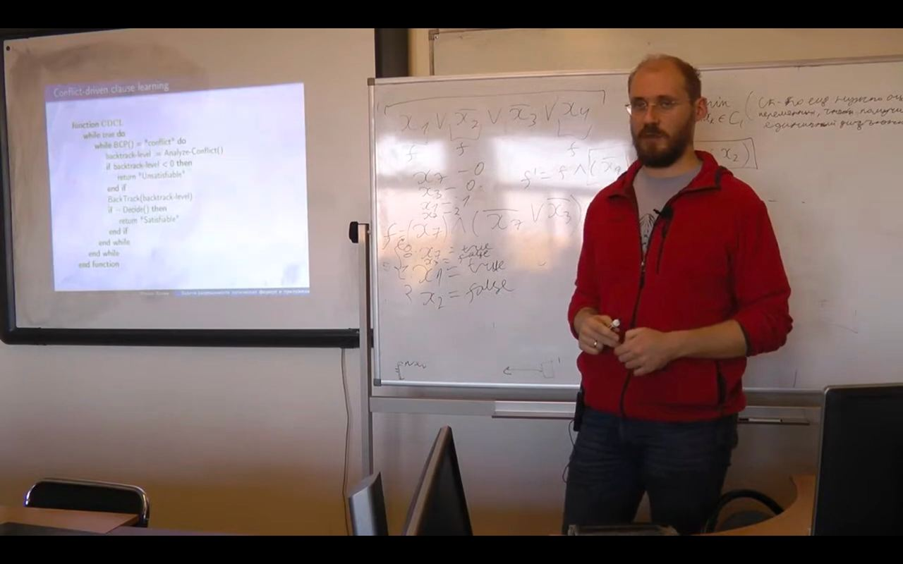

# Boolean satisfiability problems and their applications
***

### Description:
A course for 1st year Master's students of the Faculty of Computational Mathematics and Cybernetics of Lomonosov Moscow State University.

### Links:
* 🎥 [Video lectures](https://disk.yandex.ru/d/2O9UqG2zds1T6w)
* 🔗 [Course GitHub](https://github.com/RomanKholin94/Boolean-satisfiability-problem-and-application) 
* 👨🏼‍🏫 Lecturer: [Roman Kholin](https://istina.msu.ru/profile/romankholin94/)

### Lecture topics:
1. [Intro to course. SAT and UNSAT](https://github.com/Sharrish/boolean_satisfiability_problem_and_application/blob/main/lecture_presentations/lection01.pdf)
2. [Representation of the problem for solvers.](https://github.com/Sharrish/boolean_satisfiability_problem_and_application/blob/main/lecture_presentations/lection02.pdf)
3. [Representation of the problem for solvers. Intro to SMT.](https://github.com/Sharrish/boolean_satisfiability_problem_and_application/blob/main/lecture_presentations/lection03.pdf)
4. [Intro to SMT.](https://github.com/Sharrish/boolean_satisfiability_problem_and_application/blob/main/lecture_presentations/lection04.pdf)
5. [Algorithm Conflict-Driven Clause Learning (CDCL).](https://github.com/Sharrish/boolean_satisfiability_problem_and_application/blob/main/lecture_presentations/lection05.pdf)
6. [CDCL optimizations.](https://github.com/Sharrish/boolean_satisfiability_problem_and_application/blob/main/lecture_presentations/lection06.pdf)
7. [The Davis–Putnam–Logemann–Loveland algorithm (Theory). Equality logic and non-interpreted functions.](https://github.com/Sharrish/boolean_satisfiability_problem_and_application/blob/main/lecture_presentations/lection07.pdf)
8. [Equality logic and non-interpreted functions.](https://github.com/Sharrish/boolean_satisfiability_problem_and_application/blob/main/lecture_presentations/lection08.pdf)
9. [Array logic.](https://github.com/Sharrish/boolean_satisfiability_problem_and_application/blob/main/lecture_presentations/lection09.pdf)
10. [Combining logic.](https://github.com/Sharrish/boolean_satisfiability_problem_and_application/blob/main/lecture_presentations/lection10.pdf)
11. [Symbolic execution.](https://github.com/Sharrish/boolean_satisfiability_problem_and_application/blob/main/lecture_presentations/lection11.pdf)
12. [Program analysis.](https://github.com/Sharrish/boolean_satisfiability_problem_and_application/blob/main/lecture_presentations/lection12.pdf)
13. [Application in biology.](https://github.com/Sharrish/boolean_satisfiability_problem_and_application/blob/main/lecture_presentations/lection13.pdf)

### Homework assignments:
1. [Homework 1. CNF, AtMostTwo, SAT-solver](https://github.com/Sharrish/boolean_satisfiability_problem_and_application/tree/main/hw1)
2. [Homework 2. colorA, colorB, DIMACS, n-Sudoku, SMT-solver](https://github.com/Sharrish/boolean_satisfiability_problem_and_application/tree/main/hw2)
3. [Homework 3. Engine for symbolic execution of C-code](https://github.com/Sharrish/boolean_satisfiability_problem_and_application/tree/main/hw3)

